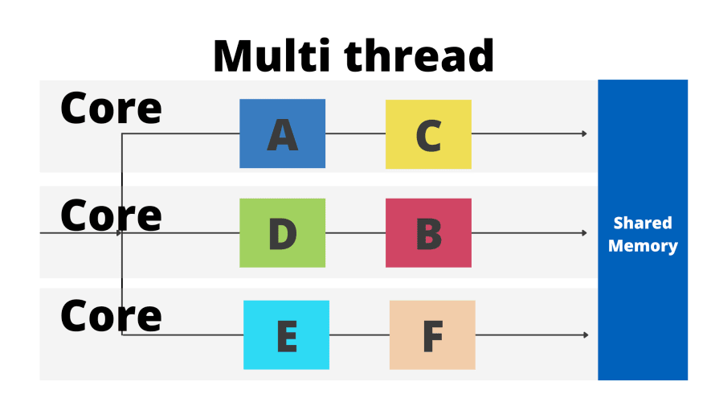

  1. Trivia Questions
     1. Is Nodejs single threaded
        1. A Nodejs application runs using the event loop. The event loop allows Nodejs to perform non-blocking I/O (input output) operations and explains how Nodejs can be async.
           The event loop aka the main thread, allows running one thing at a time.
           Nodejs Javascript code runs on a single thread.
        2. What is a single threaded process
           1. It is the execution of programmed instructions in a single sequence. 
              If we have Instructions A, B, C, these are performed liked A->B->C in a single threaded process
        3. What is a multi-threaded process
           1. It is the execution of programmed instructions in multiple sequences. Therefore, instructions wont have to wait to execute unless multiple instructions are grouped within different sequences.
              
        4. Event loop runs things single threaded but "puts aside" the long time consuming I/O operations like Api request allowing it to run the rest of the instructions.
        5. Answer: Nodejs uses singlethreaded event loop model.
     2. Nodejs event loop
        1. [Link](https://nodejs.org/en/docs/guides/event-loop-timers-and-nexttick)
     3. What are callbacks
        1. Answer: Is a function passed into another function as an argument, which is then invoked inside the outer function
     4. What are middleware in nodejs
        1. Answer: A request handler with access to the application's request-response cycle (req, res, next)
           They can also execute code, make changes to the request and response objects, end the request response cycle, call the next middleware in the stack.
     5. What are control flow functions
        1. Answer: Functions used to manage the flow of async operations and handle the execution order of code.
         [Link](https://medium.com/capital-one-tech/node-js-control-flow-an-overview-68f76ef750c3)
         Callbacks, promises, async/await, control flow libraries, generators
     6. Describe streaming in nodejs
        1. Answer: They read chunks of data piece by piece, processing its content without keeping it all in memory
           Two major advantages compared to other data handling methods:
            1. Memory efficiency: You dont need to load large amounts of data in memory before you are able to process it.
            2. Time efficiency: It takes significantly less time to start processing data as soon as you have it, rather than having to wait with processing until entire payload has been transmitted.
            Four types of streams:
            1. Writable, Readable, Duplex, Transform
          [More Info](https://nodesource.com/blog/understanding-streams-in-nodejs/)
     7. What is a rate limiter
        1. Answer: Allows you to control the rate at which user requests are processed by our server.
